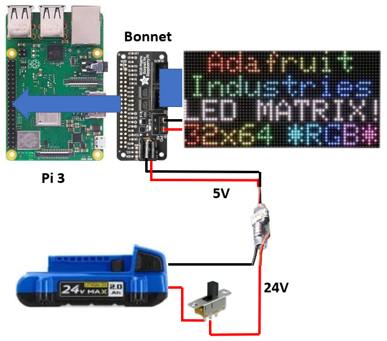

# RGB-Matrix-Bonnet

Adafruit tutorial: 
https://learn.adafruit.com/adafruit-rgb-matrix-bonnet-for-raspberry-pi/

Bonnet: 
https://www.adafruit.com/product/3211

Matrix: 
https://www.adafruit.com/product/2276

Python bindings: 
https://github.com/hzeller/rpi-rgb-led-matrix/tree/master/bindings/python

5V "Buck" Converter: 
https://www.adafruit.com/product/1385

Installation: 
https://learn.adafruit.com/adafruit-rgb-matrix-bonnet-for-raspberry-pi/driving-matrices

## Schematic

